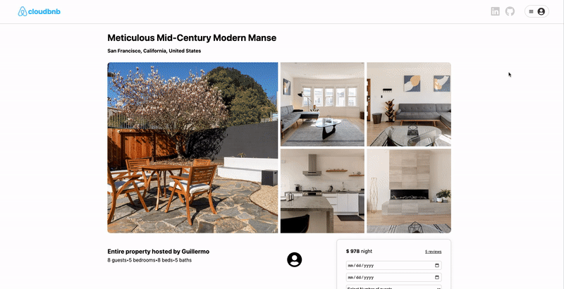
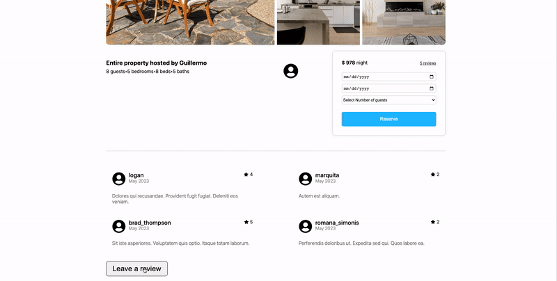

# Cloudbnb


## Live site 
- [cloudbnb](https://cloudbnb.onrender.com/)

## About

- Cloudbnb is an Airbnb clone that utilizes the power and flexibility of React to provide users with a seamless experience. This platform enables users to view a range of listings and make reservations in real time. 
- In a 14 day time frame, my aim was to faithfully recreate the feeling of the well-known Airbnb platform. My goal was to provide visitors with a user-friendly interface and design to ensure a delightful and polished experience.


## List of technologies used
- React.js frontend - The user interface was built using the popular javascript library React because of its ability to quickly create fast and modular applications 
 - Rails backend - The backend is powered by Ruby on Rails because its opinionated nature allowed me to focus on core functionality while knowing my application was built on a solid foundation
 - Amazon Web Servies - I used AWS for storing and dynamically retrieving photos because of its reliability ease of use. 
 - JBuilder - A simple Domain Specific Language for connecting the Ruby backend to the React frontend by translating Ruby into a JSON format
 - Faker to generate sample user data

## Home Page


## Make a Reservation
# 

## Leave a Review
# 

## Code Snippets
### The page for displaying reviews 
```js
import './ReviewsIndexPage.css';
import { FaUserCircle, FaStar } from 'react-icons/fa';
import { useDispatch, useSelector } from 'react-redux';
import { fetchReviews, getReviews } from '../../store/reviews';
import { useEffect, useState } from 'react';
import ReviewCreateModal from '../ReviewCreateModal';
import ReviewEditModal from '../ReviewEditModal';
import { deleteReview } from '../../store/reviews';

// ReviewsIndexPage component
const ReviewsIndexPage = ({ listingId }) => {
  // Selecting reviews from the Redux store
  const reviews = useSelector(getReviews(parseInt(listingId)));

  // Getting the user ID from the Redux store
  const userId = useSelector(state => state.session.user?.id);

  // Creating a dispatch function
  const dispatch = useDispatch();

  // State for controlling the visibility of the create review modal
  const [showReviewCreateModal, setShowReviewCreateModal] = useState(false);

  // State for controlling the visibility of the edit review modal
  const [showReviewEditModal, setShowReviewEditModal] = useState(false);

  // Fetching reviews when the component mounts or when the dispatch function changes
  useEffect(() => {
    dispatch(fetchReviews());
  }, [dispatch]);

  // State for holding the currently selected review for editing
  const [currentReview, setCurrentReview] = useState({});

  // Function to handle review editing
  const handleReviewEdit = (review) => {
    setCurrentReview(review);
    setShowReviewEditModal(prev => !prev);
  }

  return (
    <>
      {/* Displaying the create review modal if showReviewCreateModal state is true */}
      {showReviewCreateModal && (
        <ReviewCreateModal
          listingId={listingId}
          closeCreateModal={() => setShowReviewCreateModal(false)}
          reviews={reviews}
        />
      )}

      {/* Displaying the edit review modal if showReviewEditModal state is true */}
      {showReviewEditModal && (
        <ReviewEditModal
          currentReview={currentReview}
          closeEditModal={() => setShowReviewEditModal(false)}
        />
      )}

      {/* Container for displaying the reviews */}
      <div className='reviews-container'>
        {reviews && reviews.map((review) => (
          <div className='review-div' key={review.id}>
            <div className='reviews-header'>
              <div>
                {/* User profile icon */}
                <FaUserCircle className='review-profile' />
              </div>
              <div className='review-user-date-rating'>
                <div>
                  {/* Username */}
                  <div className="review-username">{review.userName}</div>
                  {/* Review date */}
                  <div className='review-date'>{new Date(review.createdAt).toLocaleDateString("en-US", {
                    month: 'long',
                    year: 'numeric'   
                  })}</div>
                </div>
                <div className='review-rating'>
                  {/* Star icon */}
                  <FaStar />
                  {/* Review rating */}
                  <div>{review.rating}</div>
                </div>
              </div>
            </div>
            {/* Review body */}
            <div className='review-body'>{review.body}</div>
            
            {/* Edit and delete buttons for the review */}
            {userId === review.userId ?    
              <>
                <button className='review-edit-delete' onClick={() => handleReviewEdit(review)}>Edit</button>
                <button className='review-edit-delete' onClick={() => dispatch(deleteReview(review.id))}>Delete</button> 
              </> 
              : null }
          </div>
        ))}
      </div>

      {/* Displaying the "Leave a review" button if a user is logged in */}
      {userId !== undefined ?  
        <div>
          <button id='review-button' onClick={() => setShowReviewCreateModal(prev => !prev)}>Leave a review</button>
        </div>
        : null }
    </>
  )
}

export default ReviewsIndexPage;
```
